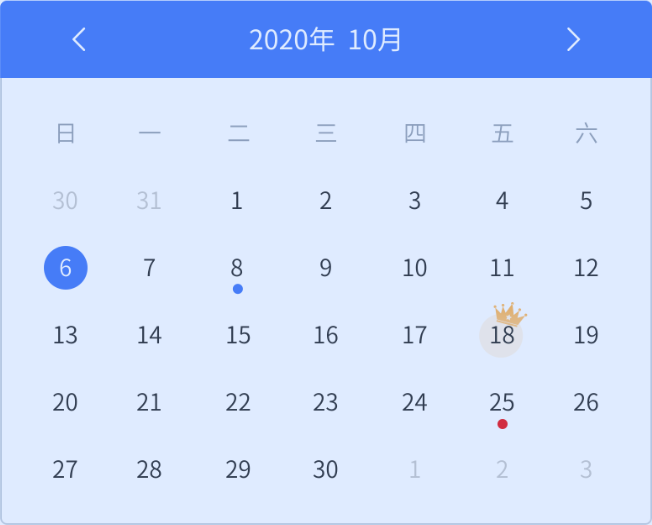

## vue-calendar-ui(当前版本 V1.1.2)

一款高效、简洁、功能丰富、宽度可自适应的 pc 端考勤日历插件

## 兼容版本

Vue2.x

## Install

```javascript
	npm i vue-calendar-ui -S

	//main.js
	import cv from "vue-calendar-ui";
	Vue.use(cv)

	//页面使用
	<vue-calendar-ui
          ref="cv"
          :mark-arr="mark"
          title-color="#333"
          arrow-color="#333"
          crrentdaybg-color="#333"
          hoverbg-color="#333"
          hoverlabel-color="red"
          weeklabel-color="red"
          @onclickdate="onclickdate"
          @onchangemonth="onchangemonth"
	></vue-calendar-ui>

	//跳转指定月份api调用
	this.$refs.cv.jumpToMonth("2020-03-12");
```

## ui 效果图



## Attribute

| 属性                 | 类型    | 说明                               | 默认                 | 是否必传 |
| -------------------- | ------- | ---------------------------------- | -------------------- | -------- |
| min                  | Boolean | 考勤样式尺寸(小)                   | FALSE                | FALSE    |
| sunday-start         | Boolean | 日历是否周天开始                   | FALSE                | FALSE    |
| title-color          | String  | title 颜色                         | #333333              | FALSE    |
| weeklabel-color      | String  | 礼拜几字体颜色                     | #9da5b1              | FALSE    |
| arrow-color          | String  | 箭头颜色                           | #4b7df6              | FALSE    |
| itembg-color         | String  | 默认日期背景颜色                   | #fff                 | FALSE    |
| itemlabel-color      | String  | 默认日期字体颜色                   | #333333              | FALSE    |
| birthdaybg-color     | String  | 当天生日的背景颜色                 | #FFF5E7              | FALSE    |
| birthdaylabel-color  | String  | 当天生日的字体颜色                 | #333333              | FALSE    |
| crrentdaybg-color    | String  | 今天的背景颜色                     | #4b7df6              | FALSE    |
| crrentdaylabel-color | String  | 今天的字体颜色                     | #fff                 | FALSE    |
| clickdaybg-color     | String  | 当前点击日期的背景颜色             | rgba(51, 51, 51,0.8) | FALSE    |
| clickdaylabel-color  | String  | 当前点击日期的字体颜色             | #fff                 | FALSE    |
| hoverbg-color        | String  | 鼠标经过背景颜色                   | #4b7df6              | FALSE    |
| hoverlabel-color     | String  | 鼠标经过字体颜色                   | #fff                 | FALSE    |
| prev-color           | String  | 当月之前的日期颜色                 | #cccccc              | FALSE    |
| next-color           | String  | 当月之后的日期颜色                 | #cccccc              | FALSE    |
| birthday-arr         | Array   | 需要标记生日日期列表(下方详细说明) | []                   | FALSE    |
| mark-arr             | Array   | 需要标记的日期列表(下方详细说明)   | []                   | FALSE    |

## birthday-arr

| 类型   | 示例                        |
| ------ | --------------------------- |
| String | ["2020/05/20","2020/05/21"] |

## mark-arr

| 属性        | 类型    | 说明                                            | 格式       | 默认    |
| ----------- | ------- | ----------------------------------------------- | ---------- | ------- |
| date        | String  | 需要标记的日期                                  | YYYY/MM/DD |         |
| color       | String  | 要标记日期底部图标或字的颜色                    |            | #333333 |
| isLabel     | Boolean | 要标记日期底部是否显示文字                      | true/false | false   |
| label       | String  | 要标记日期底部设置显示文字时的 label            |            |
| userPopover | Boolean | 有额外信息标记的时候是否使用默认的 Popover 显示 | true/false | false   |
| markContent | String  | 额外需要标注的内容                              |            |
| renderHtml  | Boolean | 额外需要标注的内容是否采用渲染 html 的格式      | true/false | false   |

## 回调函数

| 函数名        | 说明                 | 返回值                                                                |
| ------------- | -------------------- | --------------------------------------------------------------------- |
| onclickdate   | 点击具体日期时的回调 | object，包含日期时间以及主动传递的 mark 值及是否当天有生日 isBirthday |
| onchangemonth | 点击具体日期时的回调 | object，包含点击按钮切换类型 type 及 day1(切换到相应月份的 1 号)      |

## API

| 函数名            | 说明           | 参数格式               | 调用示例                                      |
| ----------------- | -------------- | ---------------------- | --------------------------------------------- |
| jumpToMonth(date) | 跳转到指定月份 | date 对象或 YYYY-MM-DD | <vue-calendar-ui ref="cv" ></vue-calendar-ui> |

//调用方法
this.$refs.cv.jumpToMonth("2020-03-12");

## Other

1、如果有其他问题邮件沟通1195669615@qq.com或者加 qq1195669615。若插件能够帮助到您，期待您的 star 哦！

2、后继会继续更新 vue3 版本
